# Braille

Material de pesquisa sobre educação especial: Braille

## Visão Geral

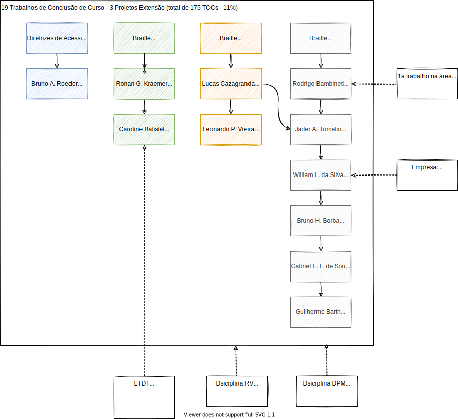  

## Diretrizes de Acessibilidade

- TCC: [Link](README.md#t%C3%ADtulo-adaptação-do-portal-inversos-às-diretrizes-de-acessibilidade-wcag-20 "link") (2017/I) Bruno A. Roeder - Adaptação do Portal Inversos às Diretrizes de Acessibilidade Wcag 2.0  

- Objetivos: adequar o Portal InVersos às diretrizes de acessibilidade do WCAG 2.0 (ferramenta automática de validação) e aliar aspectos de interação humana com a acessibilidade do portal.

- Conteúdo:  
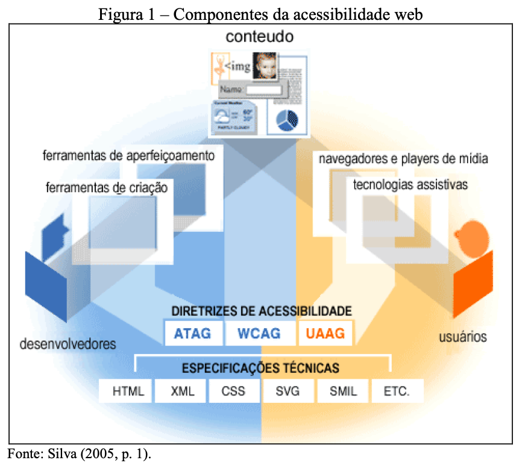  
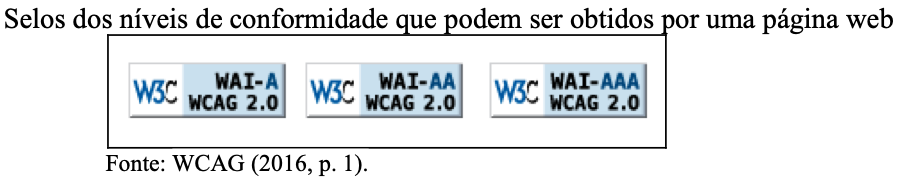  
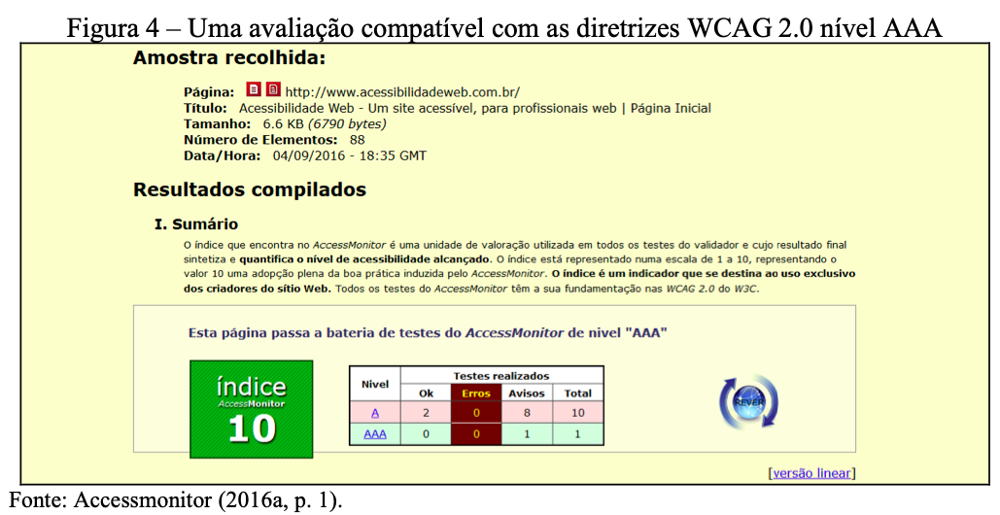  

- Analise:  
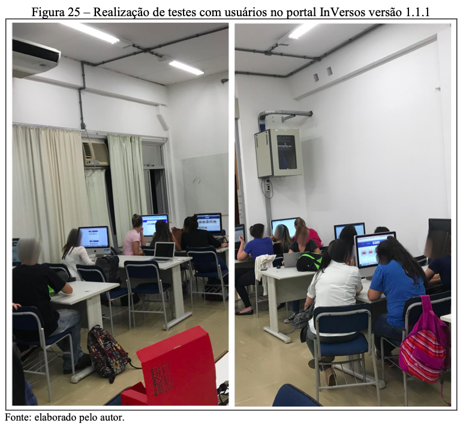  

- Resultados:  
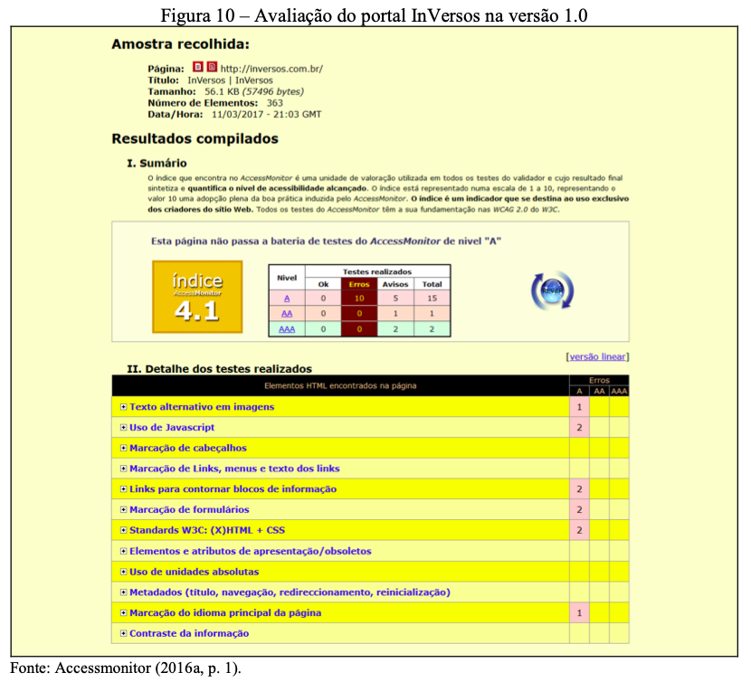  
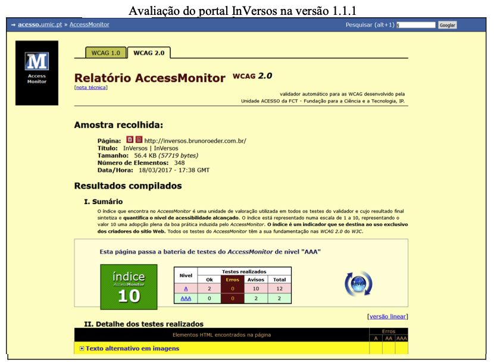  

- Agradecimentos:  
Prof. Maurício C. Lopes (FURB - LIFE) e os alunos do curso de Pedagogia.  

## Braille Jogos

- TCC: [Link](README.md#t%C3%ADtulo-tecnologia-assistiva-tornando-jogo-de-mesa-acess%C3%ADvel-para-cegos-com-aux%C3%ADlio-de-aplicativo-móvel-de-reconhecimento-de-imagem "link") (2017/I) Ronan G. Kraemer - Tecnologia Assistiva: Tornando Jogo de Mesa Acessível para Cegos com Auxílio de Aplicativo Móvel de Reconhecimento de Imagem  

- Objetivos: criar um aplicativo móvel para permitir que pessoas cegas possam participar de uma partida de Munchkin. E adaptar o jogo físico para aumentar a jogabilidade para o deficiente visual sem alterar as características do próprio jogo.  

- Conteúdo:  
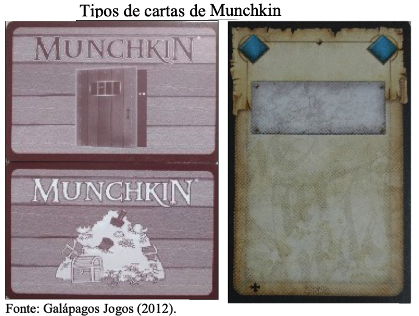  

- Analise:  
  

- Resultados:  
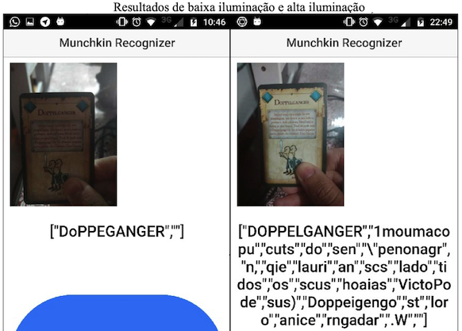  

- Agradecimentos:  
Paciência do orientando em me ensinar um pouco sobre o jogo de cartas 😁

----

- TCC: [Link](README.md#t%C3%ADtulo-estudo-de-tecnologias-assistivas-para-deficientes-visuais-aplicadas-a-plataforma-furbot "link") (2020/I) Caroline Batistel - Estudo de Tecnologias Assistivas para Deficientes Visuais Aplicadas a Plataforma Furbot  

- Objetivos: construir uma variação do jogo Furbot com suporte à recursos de acessibilidade para pessoas cegas ou com baixo nível de visão. E, assim disponibilizar um módulo de audiodescrição integrado ao Furbot, que permita a pessoa se localizar, sem interferir na forma de encontrar a solução das atividades apresentadas; criar estratégias para auxiliar os usuários a se localizarem e atravessarem uma fase de teste.  

- Conteúdo:  
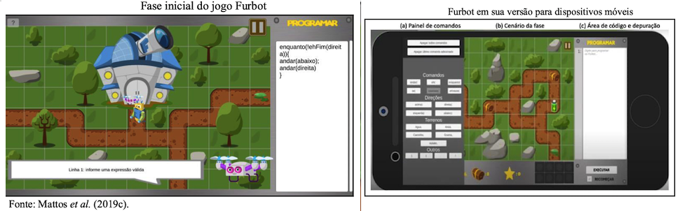  

- Analise:  
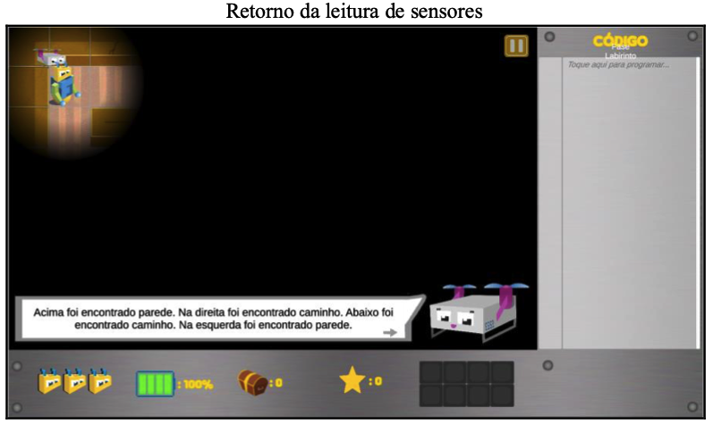  
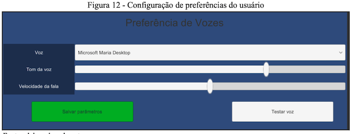  
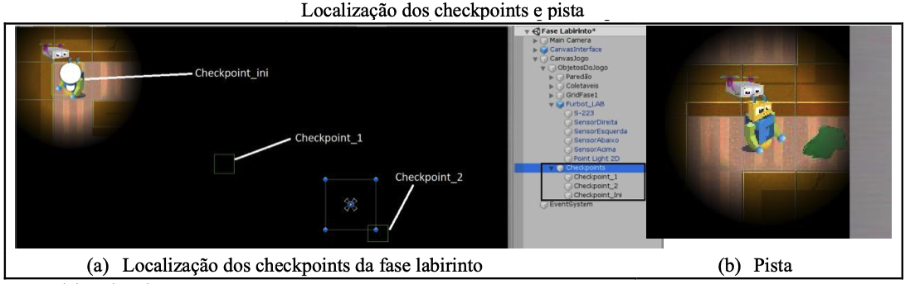  
  

- Resultados:  
Muito a ser trabalhado ...

- Agradecimentos:  
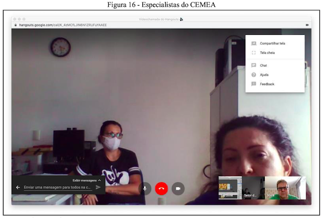  
Reunião com as especialistas (Fernanda J. Pacheco e Leia P. Andrade) do Centro Municipal de Educação Alternativa (CEMEA) de Blumenau, que assistiram uma demonstração do protótipo e deram suas considerações referente as novas funcionalidades e a aplicação do TTS. A entrevista foi realizada no dia 12 de maio de 2020.  

----

- TCC: [Link](README.md#t%C3%ADtulo-interface-de-usuário-tang%C3%ADvel-para-trabalhar-com-pensamento-computacional-no-furbot "link") (2020/I) Jonathan M. Kuntz - Interface de Usuário Tangível para Trabalhar com Pensamento Computacional no Furbot  

- Objetivos:  

- Conteúdo:  

- Analise:  

- Resultados:  

- Agradecimentos:  

## Braille Educação

- TCC: [Link](README.md#t%C3%ADtulo-aprendendo-braille-o-ensino-do-sistema-braille-com-o-uso-do-tagarela "link") (2016/I) Lucas Cazagranda - Aprendendo Braille: O Ensino do Sistema Braille com o Uso do Tagarela  

- Objetivos:  

- Conteúdo:  

- Analise:  

- Resultados:  

- Agradecimentos:  

- TCC: [Link](README.md#t%C3%ADtulo-tagarela-braille-app-para-aux%C3%ADlio-no-aprendizado-ao-braille "link") (2020/II) Leonardo P. Vieira - Título: Tagarela Braille: App para Auxílio no Aprendizado ao Braille  

- Objetivos:  

- Conteúdo:  

- Analise:  

- Resultados:  

- Agradecimentos:  

## Braille Equipamento

- TCC: [Link](README.md#t%C3%ADtulo-ferramenta-de-reconhecimento-de-gestos-da-mão "link") (2008-II) Rodrigo Bambineti - Ferramenta de Reconhecimento de Gestos da Mão  

- Objetivos:  

- Conteúdo:  

- Analise:  

- Resultados:  

- Agradecimentos:  

- TCC: [Link](README.md#t%C3%ADtulo-touch-braile-equipamento-acess%C3%ADvel "link") (2019/I) Jader A. Tomelin - Touch Braile: Equipamento Acessível  

- Objetivos:  

- Conteúdo:  

- Analise:  

- Resultados:  

- Agradecimentos:  

- TCC: [Link](README.md#t%C3%ADtulo-blackglasses-assistente-para-deficientes-visuais-via-geolocalização "link") (2019/II) William L. da Silva - BlackGlasses: Assistente para Deficientes Visuais Via Geolocalização  

- Objetivos:  

- Conteúdo:  

- Analise:  

- Resultados:  

- Agradecimentos:  

(2021-II) Bruno H. Borba - Explorar Digitalização 3D em Tempo Real Utilizando Recursos iOS  
(2022-I) Gabriel L. F. de Souza - Desenvolvimento de uma Biblioteca para o Uso do Sensor LiDAR em Dispositivos iOS  
(2022-I) Guilherme Barth - Óculos de Realidade Virtual para Auxiliar as Pessoas com Deficiência Visual a Transitarem em Lugares Aberto e Fechados  

- Objetivos:  

- Conteúdo:  

- Analise:  

- Resultados:  

- Agradecimentos:  
