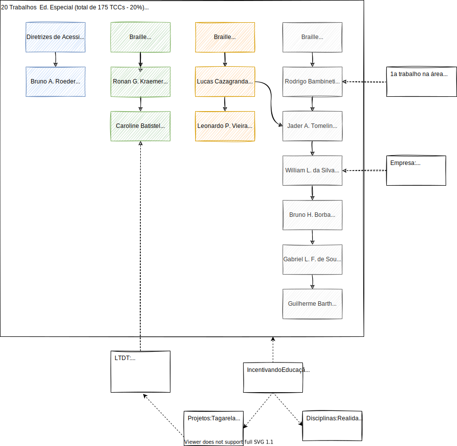
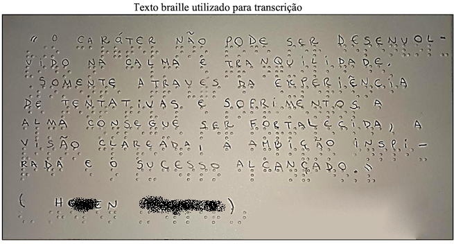

# Braille

Material de pesquisa sobre educação especial: Braille

## Visão Geral

  

## Diretrizes de Acessibilidade

### TCC: [Link](README.md#t%C3%ADtulo-adaptação-do-portal-inversos-맙-diretrizes-de-acessibilidade-wcag-20 "link") (2017/I) Bruno A. Roeder - Adaptação do Portal Inversos 맙 Diretrizes de Acessibilidade Wcag 2.0  

- Objetivos: adequar o Portal InVersos às diretrizes de acessibilidade do WCAG 2.0 (ferramenta automática de validação) e aliar aspectos de interação humana com a acessibilidade do portal.

- Conteúdo:  
  
  
  

- Analise:  
  

- Resultados:  
  
  

- Agradecimentos:  
Prof. Maurício C. Lopes (FURB - LIFE) e os alunos do curso de Pedagogia (FURB).  

## Braille Jogos

### TCC: [Link](README.md#t%C3%ADtulo-tecnologia-assistiva-tornando-jogo-de-mesa-acess%C3%ADvel-para-cegos-com-aux%C3%ADlio-de-aplicativo-móvel-de-reconhecimento-de-imagem "link") (2017/I) Ronan G. Kraemer - Tecnologia Assistiva: Tornando Jogo de Mesa Acessível para Cegos com Auxílio de Aplicativo Móvel de Reconhecimento de Imagem  

- Objetivos: criar um aplicativo móvel para permitir que pessoas cegas possam participar de uma partida de Munchkin. E adaptar o jogo físico para aumentar a jogabilidade para o deficiente visual sem alterar as características do próprio jogo.  

- Conteúdo:  
  

- Analise:  
  

- Resultados:  
  

- Agradecimentos:  
Paciência do orientando em me ensinar um pouco sobre o jogo de cartas 😁

### TCC: [Link](README.md#t%C3%ADtulo-estudo-de-tecnologias-assistivas-para-deficientes-visuais-aplicadas-a-plataforma-furbot "link") (2020/I) Caroline Batistel - Estudo de Tecnologias Assistivas para Deficientes Visuais Aplicadas a Plataforma Furbot  

- Objetivos: construir uma variação do jogo Furbot com suporte à recursos de acessibilidade para pessoas cegas ou com baixo nível de visão. E, assim disponibilizar um módulo de audiodescrição integrado ao Furbot, que permita a pessoa se localizar, sem interferir na forma de encontrar a solução das atividades apresentadas; criar estratégias para auxiliar os usuários a se localizarem e atravessarem uma fase de teste.  

- Conteúdo:  
  

- Analise:  
  
  
  
  

- Resultados:  
Muito a ser trabalhado ...

- Agradecimentos:  
  
Léia P. de Andrade e Fernanda J. Pacheco (CEMEA).  
Projeto Furbot ([LDTT](http://ldttweb.furb.br/ldtt/) - FURB).  

### TCC: [Link](README.md#t%C3%ADtulo-interface-de-usuário-tang%C3%ADvel-para-trabalhar-com-pensamento-computacional-no-furbot "link") (2020/I) Jonathan M. Kuntz - Interface de Usuário Tangível para Trabalhar com Pensamento Computacional no Furbot  

- Objetivos: criar um módulo para utilização de interface de usuário tangível no FURBOT para permitir que programação dos movimentos do robô sejam feito com peças fisicas.  

- Conteúdo:  
Inspiração <https://www.playosmo.com/en/shopping/kits/coding/>  
  
  

- Analise:  
  
  

- Resultados:  
  

- Agradecimentos:  
Projeto Furbot ([LDTT](http://ldttweb.furb.br/ldtt/) - FURB).  

## Braille Educação

### TCC: [Link](README.md#t%C3%ADtulo-aprendendo-braille-o-ensino-do-sistema-braille-com-o-uso-do-tagarela "link") (2016/I) Lucas Cazagranda - Aprendendo Braille: O Ensino do Sistema Braille com o Uso do Tagarela  

- Objetivos: criação de um módulo para o Tagarela, que possibilite, através de guias e atividades lúdicas, aprender como funciona o Sistema Braille. E assim propiciar ao usuário conhecer os sinais e séries do Sistema Braille; um ambiente para consulta de sinais braille em caso de dúvidas no processo de transcrição; proporcionar ao usuário praticar a escrita braille através de atividades de interação.  

- Conteúdo:  
  
  

- Analise:  
  

- Resultados:  
  
  
  
  

- Agradecimentos:  
Profa. Luana Tillmann.

### TCC: [Link](README.md#t%C3%ADtulo-tagarela-braille-app-para-aux%C3%ADlio-no-aprendizado-ao-braille "link") (2020/II) Leonardo P. Vieira - Título: Tagarela Braille: App para Auxílio no Aprendizado ao Braille  

- Objetivos: desenvolver um aplicativo para o auxílio no ensino de pessoas com e sem deficiência visual a utilizar o Braille, possibilitando uma melhor adaptação entre os deficientes visuais e os que convivem com eles. Acreditasse assim que esse projeto possa vir auxiliar a integração dos deficientes ao meio onde vivem, facilitando o aprendizado e adaptação, principalmente no meio educacional.  

- Conteúdo:  
Trabalho anterior: Lucas Cazagranda  

- Analise:  
  
Uso de retorno de audio para indicar a navegação usando regiões na tela:  
  

- Resultados:  
  
  

Disponível nas lojas:  
Página do Tagarella: <https://tecedufurb.github.io/braille/>  
Versão Web: <https://tecedufurb.github.io/braille/Fontes/www/index.html#/tutorial>  
PlayStore: <https://play.google.com/store/apps/details?id=com.tagarela.furb.br>  
AppleStore: indisponível.  

- Agradecimentos:  
Profa. Luana Tillmann. Lucas Cazagranda. Profa. Viviane Clotilde da Silva (matemática).  

## Braille Equipamento

### TCC: [Link](README.md#t%C3%ADtulo-touch-braile-equipamento-acess%C3%ADvel "link") (2019/I) Jader A. Tomelin - Touch Braile: Equipamento Acessível  

- Objetivos: construir um atuador Braille de baixo custo com apenas uma célula, de forma que a plataforma central seja baseada em um microcontrolador Arduino e que seja controlado por dispositivos móveis. E, assim possa ser utilizado com o Tagarella.  

- Conteúdo:  
Trabalhos anteriores: Lucas Cazagranda e Leonardo P. Vieira  
  
  

- Analise:  
  

- Resultados:  
  
  

- Agradecimentos:  
Prof. Miguel Alexandre Wisintainer (Eletrônica - FURB).  
Léia P. de Andrade, Fernanda J. Pacheco e Charles D. Belz (CEMEA).  

### TCC: [Link](README.md#t%C3%ADtulo-blackglasses-assistente-para-deficientes-visuais-via-geolocalização "link") (2019/II) William L. da Silva - BlackGlasses: Assistente para Deficientes Visuais Via Geolocalização  

- Objetivos: construir um dispositivo móvel com geolocalização, reconhecimento de fala e sintetizador de texto para fala trabalhando totalmente off-line. O dispositivo visa auxiliar deficientes visuais informando os pontos de interesses que se encontram dentro do raio do seu percurso.  

- Conteúdo:  
  

- Analise:  
  

- Resultados:  
  
  

- Agradecimentos:  
Prof. Miguel Alexandre Wisintainer (Eletrônica - FURB).  

### (2021-II) Bruno H. Borba - Explorar Digitalização 3D em Tempo Real Utilizando Recursos iOS  

Resultados Parciais: <https://github.com/dalton-reis/tcc_BrunoHenriqueBorba/blob/main/_dalton/tcc_BrunoHenriqueBorba_2021-11-30_testesCozinha.mp4>  
Resultados Parciais: <https://github.com/dalton-reis/tcc_BrunoHenriqueBorba/blob/main/_dalton/tcc_BrunoHenriqueBorba_2021-11-30_testesQuarto.mp4>

### (2022-I) Gabriel L. F. de Souza - Desenvolvimento de uma Biblioteca para o Uso do Sensor LiDAR em Dispositivos iOS  

### (2022-I) Guilherme Barth - Óculos de Realidade Virtual para Auxiliar as Pessoas com Deficiência Visual a Transitarem em Lugares Aberto e Fechados  

- Objetivos: explorar o uso de tecnologias de sensores LiDAR e Beacons (AirTag) na percepção do espaço físico do mundo real para ser utilizado no mundo virtual e explorar seu uso em Realidade Virtual Misturada, Realidade Alternativa e Metaverso.  

- Conteúdo:  
O que existe:  
  
  

Câmeras e sensor LiDAR Apple (iPhone e iPad):  
  

Digitalização do mundo real usando LiDAR - Apple:  
  

Microlocalização usando Beacons - AirTag Apple:  
  

AirTag - busca mais precisa: distância e orientação:  
  

- Analise:  
Em desenvolvimento ..  
